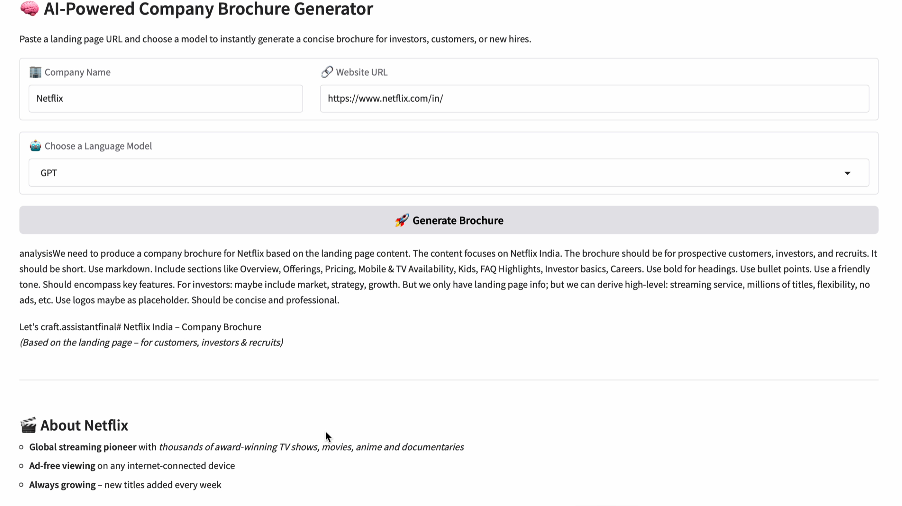
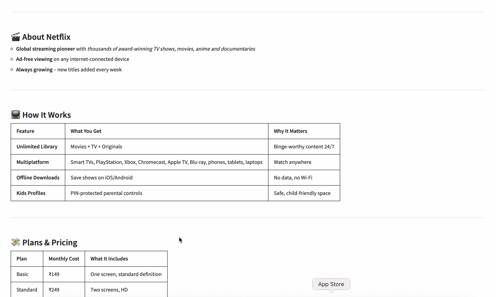

# 🧠 Brochure Creation with AI

Turn any company website into a **professional brochure** — tailored for customers, investors, or hiring — using the power of **AI** and a slick **Gradio interface**.


---

## 🚀 What It Does

Give it a **website URL** and a **company name**, and the app will:
- Extract content from the landing page
- Understand the purpose and brand tone
- Automatically generate a well-structured **brochure** using your selected AI model (GPT or Qwen)

Perfect for:
- Pitch decks
- Marketing collateral
- Career pages
- Quick overviews for clients or stakeholders

---

## 🖥️ Demo Interface

> Launches a Gradio UI with fields to input:
- ✅ Company name
- 🌐 Website URL
- 🤖 Select AI model (GPT / Qwen)

The AI processes the content and returns a **markdown-formatted brochure** you can copy, share, or repurpose!

---

## 📦 Tech Stack

- 🐍 Python
- 🎨 Gradio (for the UI)
- 🌍 BeautifulSoup (for web scraping)
- 🤖 OpenRouter API (GPT / Qwen models)
- 🔐 dotenv for secure API key handling

---

## 📸 Screenshots

<!-- Replace the paths below with your actual relative paths to your images -->





---

## 📁 How to Run Locally

1. Clone the repo:

```bash
git clone https://github.com/akashpandey2708/Broucher_Creation.git
cd Broucher_Creation
```

2. Install dependencies:

```bash
pip install -r requirements.txt
```

3.Run the app:

```bash
  run broucher.py
```


## 🙌 Credits

Created with ❤️ by Akash Pandey

Thanks to all open source projects and libraries used.
